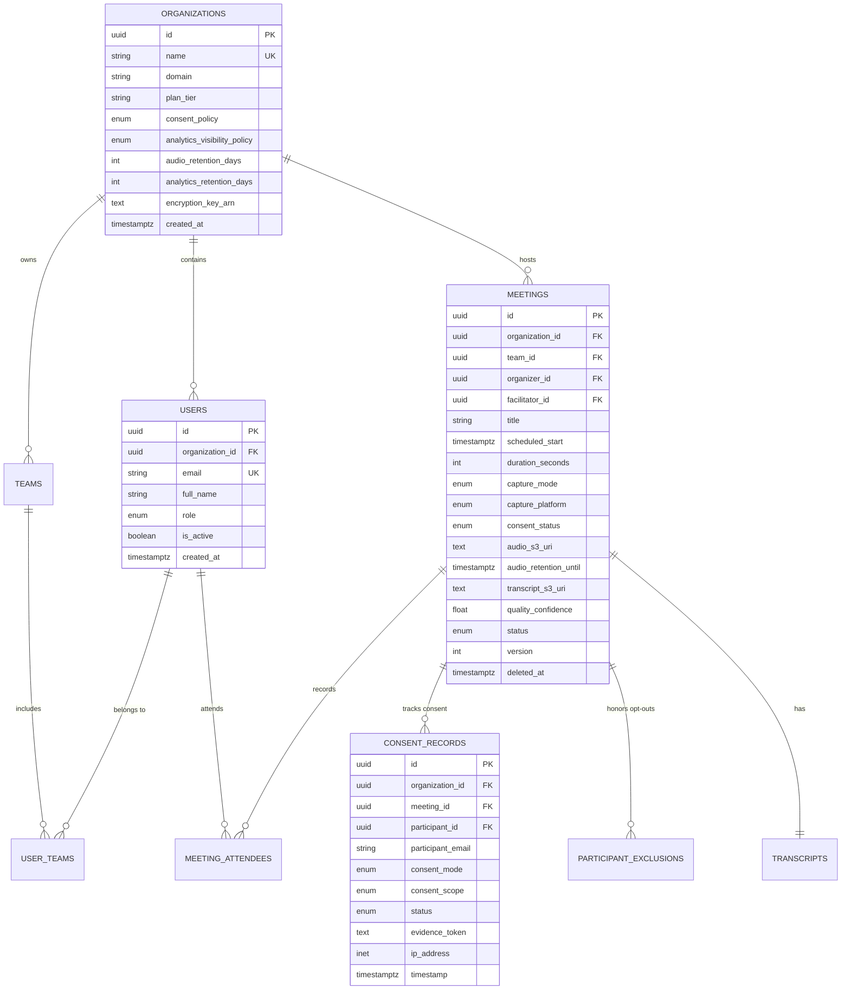
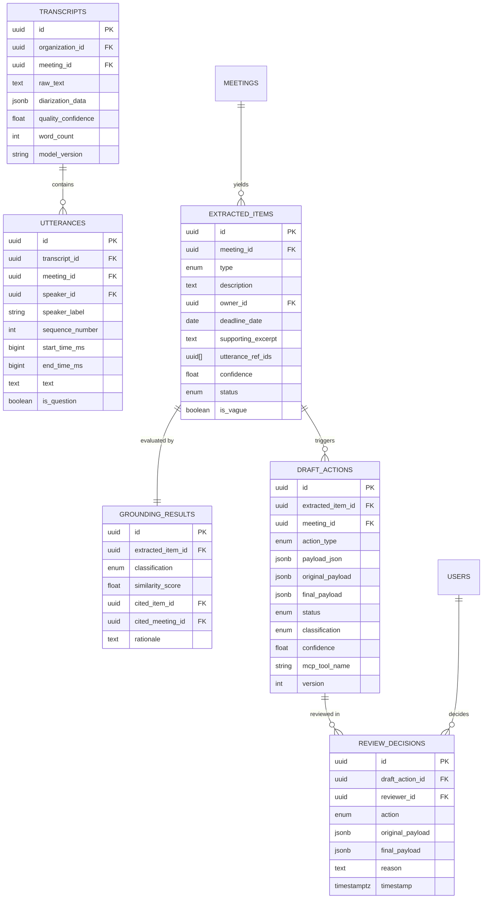
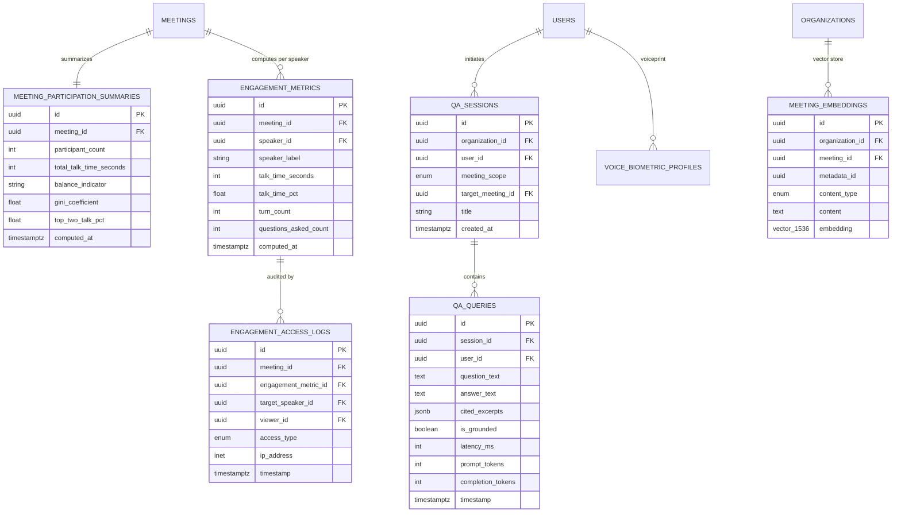

# MeetingOps Platform - Database Architecture & Schema Specification
**Conforming to: Software Requirements Specification (SRS) Version 2.0 (Final)**

---

## 1. Executive Summary & Compliance Overview

This specification defines the complete, production-grade relational and vector database architecture for **MeetingOps** (v2.0). Designed on **PostgreSQL 16+** with the **`pgvector`** and **`pgcrypto`** extensions, this architecture strictly enforces multi-tenant isolation, ethical AI constraints, Human-in-the-Loop (HITL) audit trails, consent verification, and privacy-preserving team analytics.

### 1.1 SRS v2.0 Requirements Traceability Matrix

| SRS Requirement | Subsystem / Policy | Database Implementation & Protection Mechanism |
|---|---|---|
| **FR-1.1 – FR-1.6** | Meeting Capture (Auto & Manual) | `meetings`, `meeting_attendees`, `participant_exclusions`, `consent_status` state machine |
| **FR-2.1 – FR-2.5** | Transcription & Diarization | `transcripts`, `utterances` (millisecond timestamp bounds), `voice_biometric_profiles` |
| **FR-3.1 – FR-3.3** | Structured Extraction | `extracted_items` with confidence scores, non-fabrication nullability, and prompt versioning |
| **FR-4.1 – FR-4.2** | Historical Grounding (RAG) | `grounding_results`, `meeting_embeddings` with pgvector HNSW cosine indexing & tenant isolation |
| **FR-5.1** | Validation | `extracted_items.is_vague`, `status = 'NEEDS_CLARIFICATION'`, duplicate prevention logic |
| **FR-6.1 – FR-6.2** | Draft Actions & HITL Review | `draft_actions`, `review_decisions` immutable audit log (`APPROVE`, `EDIT`, `REJECT`) |
| **FR-7.1 – FR-7.7** | Conversational Q&A Assistant | `qa_sessions`, `qa_queries` with cited transcript excerpts, latency, tokens, and audit logging |
| **FR-8.1 – FR-8.8** | Engagement Analytics | `meeting_participation_summaries` (team aggregate), `engagement_metrics` (individual), `v_secure_individual_engagement` |
| **FR-8.3 / FR-9.1** | **Anti-Scoring & Anti-Ranking** | **Hard Architectural Prohibition**: Zero score/rank columns; database check constraints; no leaderboards |
| **FR-8.4 / FR-8.7** | Privacy & Engagement Audit | `engagement_access_logs` (immutable), RLS & secure views restricting visibility to self/facilitator |
| **FR-10.1 – 10.3** | Multi-Tenancy & Consent Policy | PostgreSQL Row-Level Security (RLS) on all tenant tables; `organizations.consent_policy` |
| **FR-10.4 – 10.5** | Observability & Tracing | `agent_traces` capturing OpenTelemetry spans, token counts, and execution latencies |
| **NFR-4.1 – 4.6** | Security, Privacy & Biometrics | Encryption at rest, `voice_biometric_profiles` with explicit consent and retention TTL, ephemeral audio purge |
| **PRIV-1 – PRIV-8** | Consent & Responsible-Use | `consent_records` (immutable), `participant_exclusions` (FR-1.5 opt-out), synthetic demo tagging |

---

## 2. Entity-Relationship Diagrams (ERD)

### 2.1 Core Multi-Tenancy, Identity, and Capture Subsystem



### 2.2 Diarization, Extraction, Grounding & HITL Review Pipeline



### 2.3 Conversational Q&A and Privacy-Preserving Engagement Analytics



---

## 3. Data Dictionary & Detailed Schema Specifications

### 3.1 `organizations` (Tenant Master)
- **Purpose**: Represents an enterprise tenant with organizational policies for recording consent and analytics visibility.
- **Columns**:
  - `id` (`UUID PRIMARY KEY`): Unique tenant identifier.
  - `name` (`VARCHAR(255) NOT NULL UNIQUE`): Organization legal/display name.
  - `domain` (`VARCHAR(255)`): Email domain for SSO routing.
  - `plan_tier` (`VARCHAR(50) NOT NULL DEFAULT 'community'`): Tier (`community`, `pro`, `enterprise`).
  - `consent_policy` (`consent_policy_enum NOT NULL DEFAULT 'notify_only'`): Configurable compliance mode (`notify_only`, `meeting_opt_in`, `participant_opt_in`) per **PRIV-1**.
  - `analytics_visibility_policy` (`analytics_visibility_policy_enum NOT NULL DEFAULT 'SELF_AND_FACILITATOR'`): Visibility boundary (`SELF_AND_FACILITATOR`, `SELF_ONLY`, `MANAGER_OVERRIDE_ENABLED`) per **FR-8.4**.
  - `audio_retention_days` (`INTEGER NOT NULL DEFAULT 0`): Raw audio TTL. `0` indicates immediate deletion post-transcription per **NFR-4.2**.
  - `analytics_retention_days` (`INTEGER NOT NULL DEFAULT 365`): Individual analytics retention period per **Section 6.2**.
  - `encryption_key_arn` (`TEXT`): Customer-managed KMS key reference for envelope encryption.
  - `is_active` (`BOOLEAN NOT NULL DEFAULT TRUE`): Tenant operational status.
  - `created_at`, `updated_at` (`TIMESTAMPTZ NOT NULL DEFAULT NOW()`).

### 3.2 `users` (Identity & RBAC)
- **Purpose**: System users mapped to organizational roles.
- **Columns**:
  - `id` (`UUID PRIMARY KEY`): User identifier.
  - `organization_id` (`UUID NOT NULL REFERENCES organizations(id) ON DELETE CASCADE`): Multi-tenant boundary.
  - `email` (`VARCHAR(255) NOT NULL`): Corporate email address (`UNIQUE(organization_id, email)`).
  - `full_name` (`VARCHAR(255) NOT NULL`): User display name.
  - `role` (`user_role_enum NOT NULL DEFAULT 'PARTICIPANT'`): `ORG_ADMIN`, `FACILITATOR`, `REVIEWER`, `PARTICIPANT`, `PLATFORM_ENGINEER`.
  - `avatar_url` (`TEXT`): User profile image URL.
  - `is_active` (`BOOLEAN NOT NULL DEFAULT TRUE`).
  - `created_at`, `updated_at` (`TIMESTAMPTZ NOT NULL DEFAULT NOW()`).

### 3.3 `meetings` (Meeting Lifecycle System of Record)
- **Purpose**: Tracks scheduled, recorded, uploaded, and processed meetings.
- **Columns**:
  - `id` (`UUID PRIMARY KEY`): Meeting identifier.
  - `organization_id` (`UUID NOT NULL REFERENCES organizations(id) ON DELETE CASCADE`): Tenant boundary.
  - `team_id` (`UUID REFERENCES teams(id) ON DELETE SET NULL`): Associated team.
  - `organizer_id` (`UUID REFERENCES users(id) ON DELETE SET NULL`): Organizer.
  - `facilitator_id` (`UUID REFERENCES users(id) ON DELETE SET NULL`): Designated meeting facilitator (granted analytics visibility per **FR-8.4**).
  - `title` (`VARCHAR(500) NOT NULL`): Meeting title.
  - `scheduled_start` (`TIMESTAMPTZ NOT NULL`): Scheduled meeting start.
  - `scheduled_end`, `actual_start`, `actual_end` (`TIMESTAMPTZ`).
  - `duration_seconds` (`INTEGER`): Total duration in seconds.
  - `capture_mode` (`meeting_capture_mode_enum NOT NULL DEFAULT 'MANUAL_UPLOAD'`): `AUTO_BOT`, `MANUAL_UPLOAD`, `DIRECT_INTEGRATION`.
  - `capture_platform` (`meeting_platform_enum NOT NULL DEFAULT 'CUSTOM_AUDIO'`): `ZOOM`, `GOOGLE_MEET`, `MS_TEAMS`, `SLACK_HUDDLE`, `CUSTOM_AUDIO`.
  - `consent_status` (`meeting_consent_status_enum NOT NULL DEFAULT 'PENDING'`): `PENDING`, `SATISFIED`, `BLOCKED_NO_CONSENT`, `NOT_APPLICABLE` (enforced before capture bot joins per **FR-1.3, PRIV-2**).
  - `audio_s3_uri` (`TEXT`): Ephemeral object storage URI for raw audio.
  - `audio_retention_until` (`TIMESTAMPTZ`): Timestamp when audio must be permanently purged per **NFR-4.2**.
  - `audio_deleted_at` (`TIMESTAMPTZ`): Verification timestamp of audio deletion.
  - `transcript_s3_uri` (`TEXT`): Transcripts archive reference.
  - `quality_confidence` (`DOUBLE PRECISION`): STT overall confidence indicator (`0.0` - `1.0`) per **FR-2.4**.
  - `status` (`meeting_status_enum NOT NULL DEFAULT 'SCHEDULED'`): Lifecycle state.
  - `version` (`INTEGER NOT NULL DEFAULT 1`): Optimistic concurrency control.
  - `deleted_at` (`TIMESTAMPTZ NULL`): Soft-delete marker.
  - `created_at`, `updated_at` (`TIMESTAMPTZ NOT NULL DEFAULT NOW()`).

### 3.4 `consent_records` (Immutable Recording Compliance Log)
- **Purpose**: Records explicit per-meeting or per-participant consent decisions to satisfy legal recording and analysis regimes per **FR-1.3, PRIV-1, PRIV-2, NFR-6.3**.
- **Immutability Guarantee**: Protected by database trigger `prevent_audit_log_tampering()` against `UPDATE` and `DELETE`.
- **Columns**:
  - `id` (`UUID PRIMARY KEY`).
  - `organization_id` (`UUID NOT NULL REFERENCES organizations(id) ON DELETE CASCADE`).
  - `meeting_id` (`UUID NOT NULL REFERENCES meetings(id) ON DELETE CASCADE`).
  - `participant_id` (`UUID REFERENCES users(id) ON DELETE SET NULL`).
  - `participant_email` (`VARCHAR(255) NOT NULL`).
  - `consent_mode` (`consent_policy_enum NOT NULL`): `notify_only`, `meeting_opt_in`, `participant_opt_in`.
  - `consent_scope` (`consent_scope_enum NOT NULL`): `RECORDING`, `TRANSCRIPTION`, `ANALYTICS`, `VOICE_MATCHING`.
  - `status` (`consent_record_status_enum NOT NULL`): `PENDING`, `GRANTED`, `DECLINED`, `REVOKED`.
  - `evidence_token` (`TEXT`): Cryptographic proof token or calendar response ID.
  - `ip_address` (`INET`): Network origin of the consent decision.
  - `user_agent` (`TEXT`): Client user agent.
  - `timestamp` (`TIMESTAMPTZ NOT NULL DEFAULT NOW()`).

### 3.5 `participant_exclusions` (Analytics Opt-Out Registry)
- **Purpose**: Satisfies **FR-1.5** allowing any participant to request their speech segments be excluded from team analytics while preserving transcript integrity for extraction and grounding.
- **Columns**:
  - `id` (`UUID PRIMARY KEY`).
  - `organization_id` (`UUID NOT NULL REFERENCES organizations(id) ON DELETE CASCADE`).
  - `meeting_id` (`UUID NOT NULL REFERENCES meetings(id) ON DELETE CASCADE`).
  - `participant_id` (`UUID REFERENCES users(id) ON DELETE SET NULL`).
  - `participant_email` (`VARCHAR(255) NOT NULL`).
  - `exclude_analytics` (`BOOLEAN NOT NULL DEFAULT TRUE`).
  - `requested_at` (`TIMESTAMPTZ NOT NULL DEFAULT NOW()`).
  - `UNIQUE(meeting_id, participant_email)`.

### 3.6 `transcripts` & `utterances` (Diarized Speech Segments)
- **`transcripts`**:
  - `id` (`UUID PRIMARY KEY`).
  - `organization_id` (`UUID NOT NULL REFERENCES organizations(id) ON DELETE CASCADE`).
  - `meeting_id` (`UUID NOT NULL UNIQUE REFERENCES meetings(id) ON DELETE CASCADE`).
  - `raw_text` (`TEXT NOT NULL`): Full transcript string.
  - `diarization_data` (`JSONB NOT NULL DEFAULT '{}'::jsonb`): Raw STT speaker segmentation data.
  - `quality_confidence` (`DOUBLE PRECISION NOT NULL DEFAULT 1.0`): Quality score (FR-2.4).
  - `language_code` (`VARCHAR(10) DEFAULT 'en'`).
  - `word_count` (`INTEGER NOT NULL DEFAULT 0`).
  - `model_version` (`VARCHAR(100)`): STT model ID (e.g. `whisper-large-v3`).
- **`utterances`**:
  - `id` (`UUID PRIMARY KEY`).
  - `organization_id` (`UUID NOT NULL REFERENCES organizations(id) ON DELETE CASCADE`).
  - `transcript_id` (`UUID NOT NULL REFERENCES transcripts(id) ON DELETE CASCADE`).
  - `meeting_id` (`UUID NOT NULL REFERENCES meetings(id) ON DELETE CASCADE`).
  - `speaker_id` (`UUID REFERENCES users(id) ON DELETE SET NULL`): Mapped participant ID (FR-2.2).
  - `speaker_label` (`VARCHAR(100) NOT NULL`): Speaker tag (e.g., `"Speaker 1"`, `"Priya S."`).
  - `sequence_number` (`INTEGER NOT NULL`): Chronological order.
  - `start_time_ms` (`BIGINT NOT NULL`), `end_time_ms` (`BIGINT NOT NULL`): Millisecond timestamps (FR-2.3).
  - `text` (`TEXT NOT NULL`): Spoken sentence/paragraph.
  - `confidence` (`DOUBLE PRECISION DEFAULT 1.0`).
  - `is_question` (`BOOLEAN NOT NULL DEFAULT FALSE`): Heuristic question detection flag for analytics (FR-8.1).
  - `CONSTRAINT chk_utterance_timing CHECK (end_time_ms >= start_time_ms)`.

### 3.7 `extracted_items` & `grounding_results`
- **`extracted_items`**:
  - `id` (`UUID PRIMARY KEY`).
  - `organization_id` (`UUID NOT NULL REFERENCES organizations(id) ON DELETE CASCADE`).
  - `meeting_id` (`UUID NOT NULL REFERENCES meetings(id) ON DELETE CASCADE`).
  - `type` (`extracted_item_type_enum NOT NULL`): `ACTION_ITEM` or `DECISION` (FR-3.1).
  - `description` (`TEXT NOT NULL`): Item text.
  - `owner_id` (`UUID REFERENCES users(id) ON DELETE SET NULL`): Identified owner (nullable per **FR-3.2**; no fabrication).
  - `raw_owner_name` (`VARCHAR(255)`): Explicitly stated owner name in transcript.
  - `deadline_date` (`DATE`), `raw_deadline_text` (`VARCHAR(255)`): Stated deadline (nullable per **FR-3.2**).
  - `supporting_excerpt` (`TEXT NOT NULL`): Direct transcript quote evidence.
  - `utterance_ref_ids` (`UUID[] DEFAULT '{}'`): Array of referenced utterance IDs.
  - `confidence` (`DOUBLE PRECISION NOT NULL DEFAULT 0.0`): LLM extraction confidence (FR-3.3).
  - `status` (`extracted_item_status_enum NOT NULL DEFAULT 'EXTRACTED'`): `EXTRACTED`, `NEEDS_CLARIFICATION`, `GROUNDED`, `VALIDATED`, `DRAFTED`, `DISCARDED`.
  - `is_vague` (`BOOLEAN NOT NULL DEFAULT FALSE`): Validation flag (FR-5.1).
  - `prompt_version`, `model_version` (`VARCHAR(100)`): Provenance tracking (Section 6.2).
- **`grounding_results`**:
  - `id` (`UUID PRIMARY KEY`).
  - `organization_id` (`UUID NOT NULL REFERENCES organizations(id) ON DELETE CASCADE`).
  - `extracted_item_id` (`UUID NOT NULL UNIQUE REFERENCES extracted_items(id) ON DELETE CASCADE`).
  - `classification` (`grounding_classification_enum NOT NULL`): `NEW`, `DUPLICATE`, `CONTINUATION`, `CONFLICT` (FR-4.1).
  - `similarity_score` (`DOUBLE PRECISION`): Vector cosine similarity score against historical embedding.
  - `cited_item_id` (`UUID REFERENCES extracted_items(id) ON DELETE SET NULL`): Prior item link.
  - `cited_meeting_id` (`UUID REFERENCES meetings(id) ON DELETE SET NULL`): Prior meeting link.
  - `rationale` (`TEXT NOT NULL`): Grounding reasoning output.
  - `model_version` (`VARCHAR(100)`).

### 3.8 `draft_actions` & `review_decisions` (HITL Audit Trail)
- **`draft_actions`**:
  - `id` (`UUID PRIMARY KEY`).
  - `organization_id` (`UUID NOT NULL REFERENCES organizations(id) ON DELETE CASCADE`).
  - `extracted_item_id` (`UUID NOT NULL REFERENCES extracted_items(id) ON DELETE CASCADE`).
  - `meeting_id` (`UUID NOT NULL REFERENCES meetings(id) ON DELETE CASCADE`).
  - `action_type` (`draft_action_type_enum NOT NULL`): `CREATE_TASK`, `CALENDAR_REMINDER`, `DRAFT_EMAIL` (FR-6.1).
  - `payload_json` (`JSONB NOT NULL`): Draft MCP payload.
  - `original_payload` (`JSONB NOT NULL`), `final_payload` (`JSONB`).
  - `status` (`draft_action_status_enum NOT NULL DEFAULT 'DRAFTED'`): `DRAFTED`, `APPROVED`, `EDITED`, `REJECTED`, `EXECUTED`, `FAILED`.
  - `classification` (`grounding_classification_enum NOT NULL DEFAULT 'NEW'`).
  - `confidence` (`DOUBLE PRECISION NOT NULL DEFAULT 0.0`).
  - `mcp_tool_name` (`VARCHAR(100) NOT NULL`): Target MCP tool name.
  - `external_ref_id` (`VARCHAR(255)`): Resulting Jira/Linear/Calendar external ID upon execution.
  - `executed_at` (`TIMESTAMPTZ`): Execution timestamp (only possible after human review per **FR-6.2, NFR-6.1**).
  - `version` (`INTEGER NOT NULL DEFAULT 1`): Optimistic concurrency control.
- **`review_decisions`** (Immutable HITL Audit Log):
  - `id` (`UUID PRIMARY KEY`).
  - `organization_id` (`UUID NOT NULL REFERENCES organizations(id) ON DELETE CASCADE`).
  - `draft_action_id` (`UUID NOT NULL REFERENCES draft_actions(id) ON DELETE CASCADE`).
  - `reviewer_id` (`UUID NOT NULL REFERENCES users(id) ON DELETE RESTRICT`): Human reviewer actor.
  - `action` (`review_decision_action_enum NOT NULL`): `APPROVE`, `EDIT`, `REJECT`, `BULK_APPROVE`.
  - `original_payload` (`JSONB NOT NULL`), `final_payload` (`JSONB`).
  - `reason` (`TEXT NOT NULL`): Reviewer rationale.
  - `decision_metadata` (`JSONB DEFAULT '{}'::jsonb`).
  - `timestamp` (`TIMESTAMPTZ NOT NULL DEFAULT NOW()`).
  - **Protection**: Protected by `prevent_audit_log_tampering()` trigger against alteration or deletion.

### 3.9 `qa_sessions` & `qa_queries` (Conversational Meeting Assistant)
- **`qa_sessions`**:
  - `id` (`UUID PRIMARY KEY`).
  - `organization_id` (`UUID NOT NULL REFERENCES organizations(id) ON DELETE CASCADE`).
  - `user_id` (`UUID NOT NULL REFERENCES users(id) ON DELETE CASCADE`).
  - `meeting_scope` (`qa_scope_enum NOT NULL DEFAULT 'SINGLE_MEETING'`): `SINGLE_MEETING`, `TEAM_MEETINGS`, `ORG_HISTORY` (FR-7.5).
  - `target_meeting_id` (`UUID REFERENCES meetings(id) ON DELETE CASCADE`), `target_team_id` (`UUID REFERENCES teams(id) ON DELETE CASCADE`).
  - `title` (`VARCHAR(255) NOT NULL DEFAULT 'New Conversation'`).
  - `is_active` (`BOOLEAN NOT NULL DEFAULT TRUE`).
  - `created_at`, `updated_at` (`TIMESTAMPTZ NOT NULL DEFAULT NOW()`).
- **`qa_queries`** (Audit-Logged Q&A Invocations):
  - `id` (`UUID PRIMARY KEY`).
  - `organization_id` (`UUID NOT NULL REFERENCES organizations(id) ON DELETE CASCADE`).
  - `session_id` (`UUID NOT NULL REFERENCES qa_sessions(id) ON DELETE CASCADE`).
  - `user_id` (`UUID NOT NULL REFERENCES users(id) ON DELETE CASCADE`).
  - `question_text` (`TEXT NOT NULL`): User input query.
  - `answer_text` (`TEXT NOT NULL`): Generated response.
  - `cited_excerpts` (`JSONB NOT NULL DEFAULT '[]'::jsonb`): Array of cited transcript moments and item IDs per **FR-7.3**.
  - `is_grounded` (`BOOLEAN NOT NULL DEFAULT TRUE`): `FALSE` when "no relevant content found" fallback is triggered per **FR-7.4**.
  - `latency_ms` (`INTEGER`), `prompt_tokens` (`INTEGER`), `completion_tokens` (`INTEGER`).
  - `prompt_version`, `model_version` (`VARCHAR(100)`).
  - `timestamp` (`TIMESTAMPTZ NOT NULL DEFAULT NOW()`).

### 3.10 `meeting_participation_summaries` & `engagement_metrics` (Privacy-Preserving Analytics)
- **`meeting_participation_summaries`** (Team-Level Descriptive Aggregates per **FR-8.2, FR-8.5**):
  - `id` (`UUID PRIMARY KEY`).
  - `organization_id` (`UUID NOT NULL REFERENCES organizations(id) ON DELETE CASCADE`).
  - `meeting_id` (`UUID NOT NULL UNIQUE REFERENCES meetings(id) ON DELETE CASCADE`).
  - `participant_count` (`INTEGER NOT NULL`): Number of attendees.
  - `total_talk_time_seconds` (`INTEGER NOT NULL`): Aggregate speaking duration.
  - `balance_indicator` (`VARCHAR(255) NOT NULL`): Factual descriptive framing (e.g., `"2 of 6 participants accounted for 70% of talk time"`).
  - `gini_coefficient` (`DOUBLE PRECISION`): Statistical equality metric (`0.0` to `1.0`).
  - `top_two_talk_pct` (`DOUBLE PRECISION`): Percentage of time taken by the two longest speakers.
  - `descriptive_notes` (`TEXT`): Contextual framing notes per **FR-8.6**.
  - `computed_at` (`TIMESTAMPTZ NOT NULL DEFAULT NOW()`).
- **`engagement_metrics`** (Individual-Level Factual Metrics per **FR-8.1, FR-8.3, FR-8.4**):
  - `id` (`UUID PRIMARY KEY`).
  - `organization_id` (`UUID NOT NULL REFERENCES organizations(id) ON DELETE CASCADE`).
  - `meeting_id` (`UUID NOT NULL REFERENCES meetings(id) ON DELETE CASCADE`).
  - `speaker_id` (`UUID REFERENCES users(id) ON DELETE CASCADE`).
  - `speaker_label` (`VARCHAR(100) NOT NULL`): Diarized speaker name.
  - `talk_time_seconds` (`INTEGER NOT NULL DEFAULT 0`): Factual speaking seconds.
  - `talk_time_pct` (`DOUBLE PRECISION NOT NULL DEFAULT 0.0`): Percentage of meeting duration.
  - `turn_count` (`INTEGER NOT NULL DEFAULT 0`): Number of speaking turns.
  - `questions_asked_count` (`INTEGER NOT NULL DEFAULT 0`): Heuristic question count.
  - `computed_at` (`TIMESTAMPTZ NOT NULL DEFAULT NOW()`).
  - **HARD ETHICAL CONSTRAINT (FR-8.3, FR-9.1, PRIV-4)**: Zero columns exist for performance scores, rankings, percentiles, or individual evaluation grades. Check constraints strictly enforce valid positive counts and percentages.
- **`engagement_access_logs`** (Access Audit Trail per **FR-8.7, NFR-6.2**):
  - `id` (`UUID PRIMARY KEY`).
  - `organization_id` (`UUID NOT NULL REFERENCES organizations(id) ON DELETE CASCADE`).
  - `meeting_id` (`UUID NOT NULL REFERENCES meetings(id) ON DELETE CASCADE`).
  - `engagement_metric_id` (`UUID REFERENCES engagement_metrics(id) ON DELETE CASCADE`).
  - `target_speaker_id` (`UUID REFERENCES users(id) ON DELETE SET NULL`): The user whose individual data was inspected.
  - `viewer_id` (`UUID NOT NULL REFERENCES users(id) ON DELETE CASCADE`): The user who initiated the view.
  - `access_type` (`engagement_access_type_enum NOT NULL`): `VIEW_OWN`, `VIEW_FACILITATOR`, `VIEW_ADMIN_AUDIT`.
  - `ip_address` (`INET`), `user_agent` (`TEXT`).
  - `timestamp` (`TIMESTAMPTZ NOT NULL DEFAULT NOW()`).
  - **Protection**: Protected by `prevent_audit_log_tampering()` trigger against modification or deletion.

### 3.11 `meeting_embeddings` & `voice_biometric_profiles`
- **`meeting_embeddings`** (pgvector HNSW Vector Store per **FR-4.1, FR-4.2**):
  - `id` (`UUID PRIMARY KEY`).
  - `organization_id` (`UUID NOT NULL REFERENCES organizations(id) ON DELETE CASCADE`): Tenant boundary.
  - `meeting_id` (`UUID NOT NULL REFERENCES meetings(id) ON DELETE CASCADE`).
  - `metadata_id` (`UUID NOT NULL`): Referenced entity ID (utterance, extracted item, or meeting).
  - `content_type` (`embedding_content_type_enum NOT NULL`): `UTTERANCE`, `ACTION_ITEM`, `DECISION`, `TRANSCRIPT_CHUNK`.
  - `chunk_index` (`INTEGER NOT NULL DEFAULT 0`).
  - `content` (`TEXT NOT NULL`): Text representation.
  - `embedding` (`vector(1536)`): Vector embedding vector.
  - **Index**: HNSW Index `idx_embeddings_hnsw_cosine USING hnsw (embedding vector_cosine_ops) WITH (m = 16, ef_construction = 64)`.
- **`voice_biometric_profiles`** (Biometric-Adjacent Data Protection per **NFR-4.6, PRIV-5**):
  - `id` (`UUID PRIMARY KEY`).
  - `organization_id` (`UUID NOT NULL REFERENCES organizations(id) ON DELETE CASCADE`).
  - `user_id` (`UUID NOT NULL UNIQUE REFERENCES users(id) ON DELETE CASCADE`).
  - `voiceprint_hash` (`TEXT NOT NULL`): One-way cryptographic hash of speaker acoustic features.
  - `voice_embedding` (`vector(512)`): Speaker voiceprint embedding.
  - `consent_verified` (`BOOLEAN NOT NULL DEFAULT FALSE`): Mandatory consent check before matching.
  - `retention_until` (`TIMESTAMPTZ NOT NULL`): Strict expiration deadline.
  - `created_at`, `updated_at` (`TIMESTAMPTZ NOT NULL DEFAULT NOW()`).

### 3.12 `agent_traces` (Observability Spans)
- **Purpose**: OpenTelemetry distributed traces and LLM invocation spans across all pipeline agents per **FR-10.4, FR-10.5**.
- **Columns**:
  - `id` (`UUID PRIMARY KEY`).
  - `organization_id` (`UUID NOT NULL REFERENCES organizations(id) ON DELETE CASCADE`).
  - `meeting_id` (`UUID NOT NULL REFERENCES meetings(id) ON DELETE CASCADE`).
  - `trace_id` (`VARCHAR(64)`), `span_id` (`VARCHAR(32)`), `parent_span_id` (`VARCHAR(32)`).
  - `agent_role` (`VARCHAR(50) NOT NULL`): `CAPTURE`, `TRANSCRIBER`, `EXTRACTION`, `GROUNDING`, `VALIDATION`, `DRAFTING`, `QA`, `ANALYTICS`.
  - `step_index` (`INTEGER NOT NULL`).
  - `tool_called` (`TEXT`), `tool_input` (`JSONB`), `tool_output` (`JSONB`).
  - `reasoning_excerpt` (`TEXT`): Extracted Chain-of-Thought reasoning.
  - `latency_ms` (`INTEGER`), `prompt_tokens` (`INTEGER`), `completion_tokens` (`INTEGER`).
  - `timestamp` (`TIMESTAMPTZ NOT NULL DEFAULT NOW()`).
  - **Protection**: Protected by `prevent_audit_log_tampering()` trigger against modification or deletion.

---

## 4. Security, Privacy & Compliance Architecture

### 4.1 Multi-Tenant Logical Isolation (RLS)
PostgreSQL Row-Level Security is active on every organization table. When an application service establishes a database transaction, it sets the current tenant context:

```sql
-- Executed per-request / per-connection:
SET LOCAL app.current_org_id = 'c38a4d78-b179-4d64-9844-3d027cf884c9';
SET LOCAL app.current_user_id = 'e76b2f12-0941-47a3-8321-70bf812c75a2';
SET LOCAL app.current_user_role = 'FACILITATOR';
```

All queries automatically apply the tenant isolation policy:
```sql
CREATE POLICY teams_tenant_isolation_policy ON teams
FOR ALL
USING (
    organization_id = NULLIF(current_setting('app.current_org_id', true), '')::uuid
    OR current_setting('app.bypass_rls', true) = 'true'
);
```

### 4.2 Data-Layer Privacy Protection for Individual Metrics (FR-8.4)
To ensure application bugs cannot leak peer engagement data, access to individual engagement metrics is restricted through the secure view `v_secure_individual_engagement`:

```sql
CREATE OR REPLACE VIEW v_secure_individual_engagement AS
SELECT 
    em.id, em.organization_id, em.meeting_id, em.speaker_id,
    em.speaker_label, em.talk_time_seconds, em.talk_time_pct,
    em.turn_count, em.questions_asked_count, em.computed_at
FROM engagement_metrics em
JOIN meetings m ON em.meeting_id = m.id
WHERE (
    -- 1. Individual can view their own data
    em.speaker_id = NULLIF(current_setting('app.current_user_id', true), '')::uuid
    OR
    -- 2. Meeting Facilitator can view metrics for meetings they lead
    is_meeting_facilitator(em.meeting_id, NULLIF(current_setting('app.current_user_id', true), '')::uuid) = TRUE
    OR
    -- 3. Org Admin with explicit documented audit session
    (current_setting('app.current_user_role', true) = 'ORG_ADMIN' AND current_setting('app.audit_mode_enabled', true) = 'true')
);
```

### 4.3 Immutability of Audit Trails
All compliance records (`review_decisions`, `consent_records`, `engagement_access_logs`, `agent_traces`) enforce write-once immutability via database triggers:

```sql
CREATE OR REPLACE FUNCTION prevent_audit_log_tampering()
RETURNS TRIGGER AS $$
BEGIN
    RAISE EXCEPTION 'SECURITY VIOLATION: Records in table % are immutable and cannot be updated or deleted.', TG_TABLE_NAME;
END;
$$ LANGUAGE plpgsql;
```

### 4.4 Automated Ephemeral Audio & Retention Management
Scheduled background routines execute automated data purges to satisfy the minimal storage footprint requirement (**NFR-4.2, PRIV-5**):

```sql
-- Purges raw audio pointers once retention expires (Default: immediately after transcription)
SELECT purge_expired_raw_audio();

-- Purges voice biometrics past their retention date
SELECT purge_expired_voice_biometrics();
```

---

## 5. Vector Search (pgvector HNSW) & Grounding Performance

### 5.1 Hierarchical Navigable Small World (HNSW) Configuration
Vector embeddings use cosine distance indexing optimized for low-latency similarity searches within a tenant's vector namespace:

```sql
CREATE INDEX idx_embeddings_hnsw_cosine 
ON meeting_embeddings 
USING hnsw (embedding vector_cosine_ops) 
WITH (m = 16, ef_construction = 64);
```

### 5.2 Scoped Grounding & Q&A Query Pattern
Grounding and Q&A vector retrievals always filter by `organization_id` and `content_type` prior to nearest-neighbor distance calculations:

```sql
-- RAG query strictly restricted to tenant boundary (FR-4.2)
SELECT 
    me.metadata_id,
    me.content_type,
    me.content,
    1 - (me.embedding <=> :query_embedding) AS similarity_score
FROM meeting_embeddings me
WHERE me.organization_id = :org_id
  AND me.content_type IN ('DECISION', 'ACTION_ITEM')
ORDER BY me.embedding <=> :query_embedding
LIMIT 5;
```

---

## 6. Migration Execution Guide

1. The complete schema is packaged in Flyway migration script:
   `meeting-ops-backend/meeting-service/src/main/resources/db/migration/V3__srs_v2_complete_schema.sql`
2. When starting the backend with Docker Compose:
   ```bash
   cd meeting-ops-backend
   docker-compose up --build
   ```
3. Flyway will automatically apply `V1`, `V2`, and `V3` in order, creating all tables, indexes, triggers, and Row Level Security policies.
